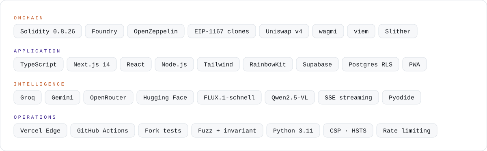

<!--
  wlylabs — GitHub profile README

  Every image below is a generated SVG that lives in this repository
  (see lib/assets.js). Nothing here depends on a third-party badge service,
  so the page renders the same on the day it is written and a year later.
-->

<div align="center">



</div>

<br />

## About

I'm an independent **solo builder**. No team, no standups — just an idea, a terminal,
and a clean commit history.

The work spans three layers and I own all of them: **onchain** (Solidity contracts
that hold real ETH), **the app in front of it** (Next.js, wallets, auth, PWA), and
**the automation behind it** (edge functions, AI pipelines, scheduled CI).

I build **AI-native** — designing, writing and reviewing alongside AI — but nothing
ships on vibes alone: contracts land with fuzz and invariant suites, endpoints land
with rate limits and a CSP, and every repo has CI that has to go green first.

<br />

## Selected work

<table>
<tr>
<th align="left" width="20%">Project</th>
<th align="left" width="46%">What it is</th>
<th align="left" width="34%">Stack</th>
</tr>

<tr>
<td valign="top">

**[Folio](https://github.com/wlylabs/Folio)**
<br />
<sub>token launchpad</sub>

</td>
<td valign="top">

Every token launch is published as an article. Each launch clones an **ERC20 that is
its own bonding-curve market maker** — buys and sells price off one constant-product
curve, so the reserve always covers every circulating token. Live on **Robinhood
Chain** with real ETH, plus a **Uniswap v4 migration** path at graduation.

</td>
<td valign="top">

`Solidity 0.8.26` `Foundry` `EIP-1167`
`Uniswap v4` `OpenZeppelin` `Slither`
<br />
`Next.js 14` `TypeScript` `wagmi`
`viem` `RainbowKit` `Supabase`

</td>
</tr>

<tr>
<td valign="top">

**[wlybot](https://github.com/wlylabs/wlybot)**
<br />
<sub>AI chat assistant</sub>

</td>
<td valign="top">

Mobile-first chat PWA on **one edge function**. Streams from Groq, falls through to
Gemini, then OpenRouter — a rate limit at any vendor never takes the app down,
because fallback happens *before* the first byte reaches the browser. Web search and
news via **tool calling**; Python code blocks run in-browser through Pyodide.

</td>
<td valign="top">

`Vercel Edge` `SSE streaming`
`Groq` `Gemini` `OpenRouter`
<br />
`Vanilla JS` `Zero deps` `PWA`
`Pyodide` `CSP + HSTS`

</td>
</tr>

<tr>
<td valign="top">

**[wlystock](https://github.com/wlylabs/wlystock)**
<br />
<sub>AI stock photo pipeline</sub>

</td>
<td valign="top">

Turns a curated prompt library into submission-ready stock photography, unattended.
Generates with **FLUX.1-schnell**, normalizes to stock aspect ratios, then captions
with a **vision-language model** to emit a titles-and-keywords CSV. Every stage has a
fallback, so one dead endpoint never stalls a run.

</td>
<td valign="top">

`Python 3.11` `Hugging Face API`
`FLUX.1-schnell` `Qwen2.5-VL`
<br />
`Pillow` `GitHub Actions` `cron`

</td>
</tr>
</table>

<br />

## Capabilities — and where to read them

<table>
<tr>
<td width="50%" valign="top">

**Smart contracts**
Bonding-curve AMM maths, EIP-1167 minimal-proxy clones, upgradeable ERC20s,
reentrancy and anti-sniper defenses. **300+ Foundry tests** across unit, fuzz,
invariant, adversarial and gas suites, plus Slither in the loop.
<sub>→ `Folio/contracts`</sub>

**Web3 frontend**
Wallet connection that constructs *nothing* until the reader asks for it, live
onchain pricing, multi-chain-aware reads and trades, deploy records as data
rather than constants.
<sub>→ `Folio/app`, `Folio/lib`</sub>

</td>
<td width="50%" valign="top">

**Applied AI**
Streaming completions, multi-provider failover, function calling, prompt design
that survives small models, untrusted-tool-output envelopes against prompt
injection, and image + vision-language generation.
<sub>→ `wlybot/api`, `wlystock/src`</sub>

**Security-minded by default**
SIWE (EIP-4361) sign-in minting a Supabase JWT that Postgres **row-level
security** enforces, origin checks, rate limits, body caps, HTML-escaped
rendering, CSP · HSTS · frame-deny headers.
<sub>→ `Folio/lib/schema.sql`, `wlybot/vercel.json`</sub>

</td>
</tr>
<tr>
<td width="50%" valign="top">

**Automation &amp; CI**
Typecheck · lint · test · build on every push, contract suites split by EVM
profile, nightly fork tests against live Uniswap v4, and scheduled pipelines
that publish their own artifacts.
<sub>→ `.github/workflows` in every repo</sub>

</td>
<td width="50%" valign="top">

**Product polish**
Installable PWAs, offline routes, themes applied before first paint, safe-area
layouts, custom Markdown rendering, SEO and OG images — the last 10% that makes
it feel finished.
<sub>→ `Folio/app`, `wlybot`</sub>

</td>
</tr>
</table>

<br />

## Stack

<div align="center">



</div>

<br />

## How I build

<table>
<tr>
<td width="50%" valign="top">

**Problem first**
I start from what has to be true, never from the boilerplate.

**Ship in slices**
Small, frequent iterations over big-bang releases.

</td>
<td width="50%" valign="top">

**Write down the why**
The reasoning lives next to the code, so future me doesn't re-litigate it.

**Prove it, don't assume it**
Tests, fuzzing and CI decide when something is done.

</td>
</tr>
</table>

<br />

## Contact

Always open to talk about onchain products, AI apps and indie building — and to
collaborate with other solo builders.

<div align="center">

<a href="https://x.com/wly0x_"></a>
&nbsp;
<a href="https://github.com/wlylabs?tab=repositories"></a>

</div>

<br />


<details>
<summary><sub>How this page is drawn</sub></summary>

<br />

The banner, the stack card and the buttons are not badge-service images — they are
SVGs generated by [`lib/assets.js`](lib/assets.js) and committed to
[`public/`](public), so nothing on this profile can break when someone else's
service goes down.

```
npm run build     render public/*.svg from the generators
npm run check     fail if the committed files drifted (runs in CI)
```

Each file carries both palettes in one document and switches on
`prefers-color-scheme`, which is why the page reads correctly in light and dark
without a second request. Motion respects `prefers-reduced-motion`.

The same generator is deployed to Vercel as an edge function, so the banner can
also be rendered live with different copy:

```
/banner
/banner?theme=dark
/banner?name=wlylabs&status=OPEN%20TO%20WORK
/banner?lines=One%20line|Another%20line
```

Configuration lives in [`vercel.json`](vercel.json): SVG content type, a shared
CDN cache with stale-while-revalidate, permissive CORS for the images, and
`nosniff` · `Referrer-Policy` · `X-Frame-Options` · HSTS on everything else.

</details>
